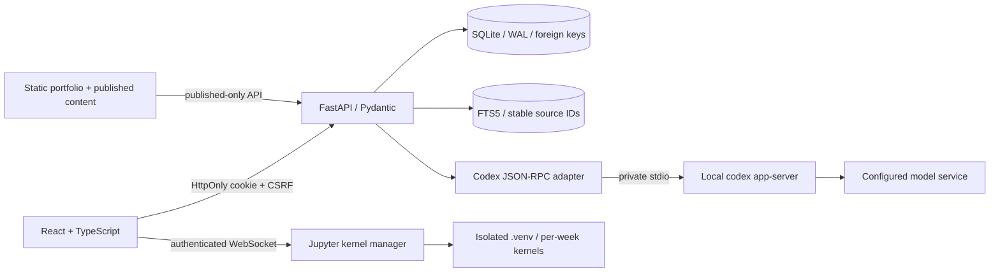

# Joker Carter workbench architecture

## Boundaries

- Public: original static pages, PDFs, curriculum, `/portfolio/`, `/blog/`, published projects/articles/profile/course material only.
- Private: `/api/resources`, Notebook kernels, document text, sessions, applications, notes, backups and AI. `/app/` HTML shell is public, but every data/execution request requires the local administrator session.
- Notebook execution is intentionally powerful administrator code, **not a malicious-code sandbox**. Only trusted code should be run. No anonymous execution endpoint remains.
- The Codex tutor is a separate text-only conversation. Local shell, browser, apps, plugins, hooks, memories, external MCP and delegation are disabled for its child process. Read-only sandbox and denied server tool/approval requests provide additional limits. No changes are made to the desktop thread, global model/provider settings or authentication files.
- Codex is a local client; model calls can still go to its configured remote service. Selected excerpts and code are shown before sending. Old messages remain part of that website chat.
- Markdown is rendered without raw HTML. Private Markdown does not automatically fetch remote images from documents or model output. Mermaid output is sanitized. Notebook HTML/JavaScript outputs are not executed; text/error/PNG output is supported.

## Data flow

Upload → size/type checks → text extraction in a worker thread → SHA-256 deduplication → page-preserving chunks → FTS5. Chinese substring queries have a literal fallback. Source IDs derive from document hash + page + chunk offset, so restore/reindex preserves citations. PDFs without extractable text report that OCR is required.

Notebook imports are validated with nbformat. Saves use a serialized client queue. Variables persist in the same kernel and are isolated across weeks. A normal stop interrupts the active execution. If Windows/native blocking code ignores interrupts, only that kernel is terminated and the output explicitly says variables were cleared.

Codex RPC requests correlate by ID; notifications route by website thread ID. Streaming output is forwarded without replaying failed generations. A process exit, timeout or protocol rejection becomes an error, never a simulated answer. Only actual token usage is displayed. Imported chat histories cannot authorize attaching to an arbitrary desktop conversation: a separate non-exported ownership registry gates resumption.

## Database

| Table | Meaning |
|---|---|
| `admin` | One administrator, Argon2 password hash |
| `sessions` | SHA-256 session token, CSRF token, expiry |
| `records` | Tasks, notes, applications, content, progress, time, legacy milestones and document links |
| `documents` | Content hash, filename, extracted page text |
| `chunks` | FTS5 content with source rowid and page |
| `notebooks` | Validated editable ipynb JSON |
| `chats` / `messages` | Website thread mapping and persistent messages/source snapshots |
| `owned_chats` | Local proof that this installation created a Codex thread; excluded from imports |
| `activity` | Operation names and timestamps, not request bodies or secrets |
| `alembic_version` | Migration revision |

SQLite connections enable foreign keys and WAL. SQLAlchemy binds query parameters. Generic records use a validated title/status plus a JSON body for feature fields; this is a deliberate single-user design, not a multi-tenant schema.

## Backup / migration

Use the Settings preview before merge restore. Existing matching IDs are updated in one transaction; credentials/sessions are not imported. Document indexes are rebuilt. The backup is JSON data, never executable SQL. Kernel-created files (for example model checkpoints) are outside the JSON backup; copy `.workbench/kernels/` separately while kernels are stopped if those outputs are important.

The old browser `jokercarter.learning.progress.v1` is previewed and imported as `legacy` milestones only. It never marks the 48 new chapter checks as completed.

## Deployment boundary

The launcher binds only `127.0.0.1`. This delivery does not purchase a domain, edit DNS, configure TLS or expose the administrator workspace publicly. A future public deployment should separate the static portfolio from this local execution service. Jupyter and the local Codex bridge should remain private.
